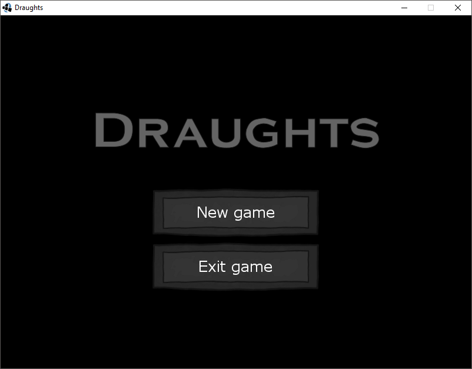
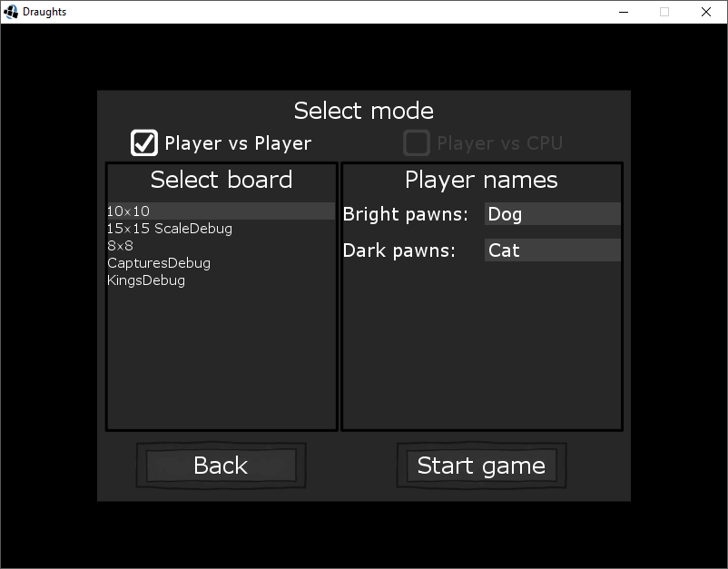
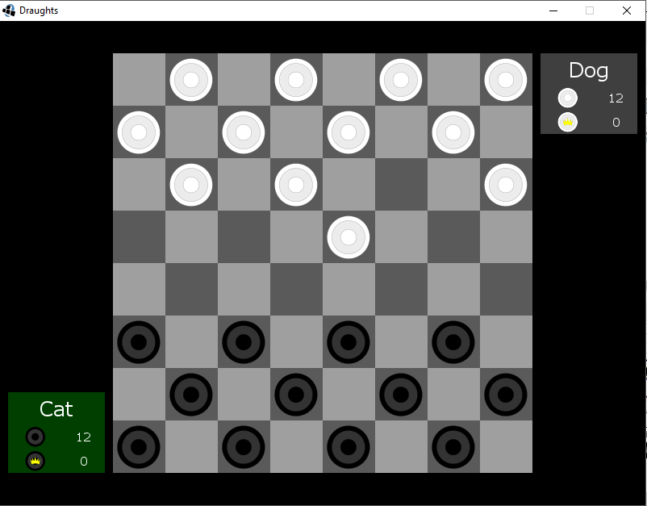
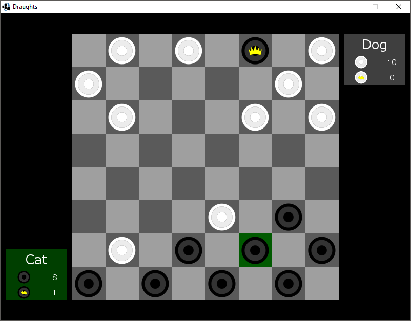
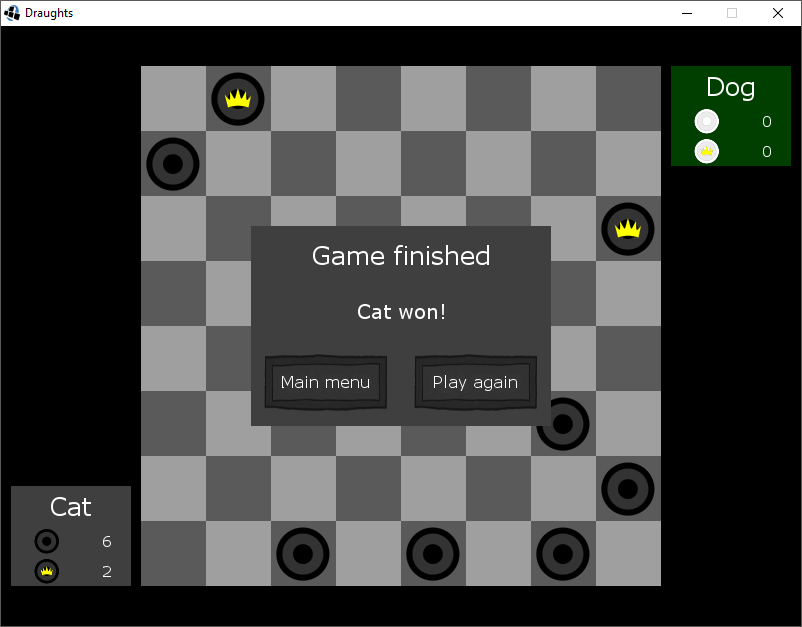

# Draughts
Draughts written in java with LibGDX

# Game
Draughts or checkers is a group of strategy board games for two players which involve diagonal moves of uniform game pieces and mandatory captures by jumping over opponent pieces. Draughts developed from alquerque. The name derives from the verb to draw or to move.
[Wikipedia](https://en.wikipedia.org/wiki/Draughts)

### To do
- Player versus CPU game mode

## Screenshots

        
        
        </img>
        
        </img>
        
        </img>
        </img>

